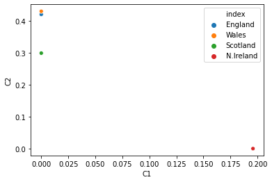

# BASIC-AUTOENCODER

This is just a simple code to understand how an autoencoder works.

It firsts encodes and then decodes.Very easy to understand.

The image shows how Ireland differs from the other mainland coutries for food consumption.

